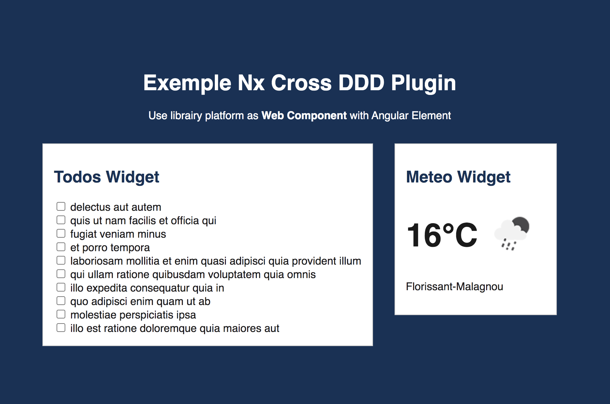

# Exemple for @fazio/nx-cross-ddd-plugin

This exemple show you how to use `nx-cross-ddd-plugin` and generate different library solution.

## Installation and Usage

- Run this following commandes: 

```
npm install 
npm start
```

## Preview (WebComponent)


## Folders Overview
### Applications
- `./apps/demo` Angular application using Lazyloading Features + WebComponent
- `./apps/demo-react` React application using Feature with routing

### Domains
- `./libs/todo/domain` Todo core logic Domain Library
- `./libs/meteo/domain` Meteo core logic Domain Library

### Features Domain
- `./libs/todo/feature-list` Todo Feature logic Library to list Todo from API
- `./libs/meteo/feature-current-weather` Meteo Feature logic Library to get current weather from position

### Platforms Feature
**Angular**
- `./libs/platform/angular/todo/feature-list` Platform UI for Todo Feature Library
- `./libs/platform/angular/meteo/feature-current-weather` Platform UI for Meteo Feature Library
- `./libs/platform/angular/shared/feature-tokens` Shared Platform Library for dependecy injection (IoD)

**React**
- `./libs/platform/react/todo/feature-list` Platform UI for Todo Feature Library
- `./libs/platform/react/meteo/feature-current-weather` Platform UI for Meteo Feature Library
